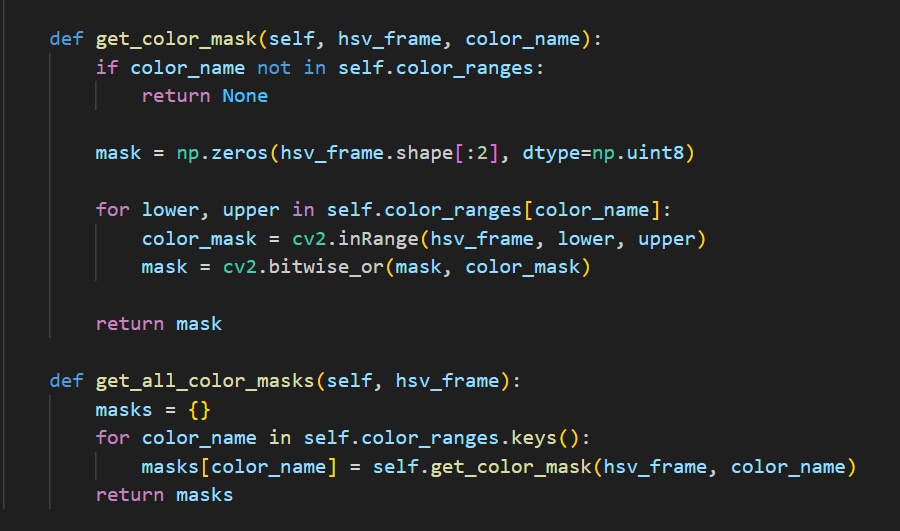
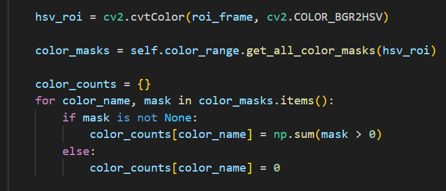
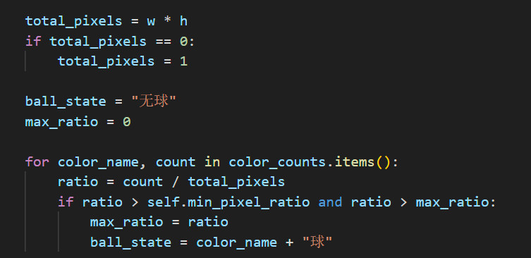

#数据处理流程：视频文件 → 帧提取 → 图像预处理 → ROI提取 → 颜色空间转换 → 颜色掩膜生成 → 像素统计 → 状态判断 → 结果展示

核心算法：

1、颜色检测算法

输入：视频帧
步骤1：旋转校正（ROTATE_180）
步骤2：提取ROI区域  
步骤3：BGR → HSV转换
步骤4：生成各颜色掩膜
步骤5：统计各颜色像素数量
步骤6：计算像素比例
步骤7：应用阈值判断状态
输出：球状态（无球/紫球/红球/蓝球）

2、状态判断逻辑

eg.
if 红色像素比例 > 阈值 and 红色比例 > 其他颜色比例:
    return "红球"
elif 蓝色像素比例 > 阈值 and 蓝色比例 > 其他颜色比例:  
    return "蓝球"
elif 紫色像素比例 > 阈值 and 紫色比例 > 其他颜色比例:
    return "紫球"
else:
    return "无球"

结合AI实现：
1、多格式视频支持
2、实时可视化反馈
3、详细的统计输出